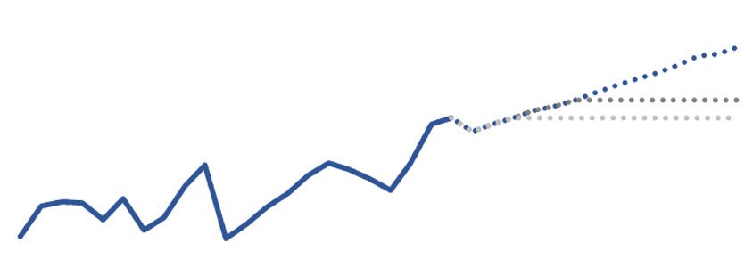

<style type="text/css">

#TOC {
margin-top: 100px;
}

.section h2{
padding-top: 150px;
}

.leftA{
float: left;
width: 100%;
font-weight: bold;
}

.leftB{
float: left;
width: 23%;
}

.leftC1{
float: left;
width: 100%;
font-weight: bold;
color: DodgerBlue;
}

.leftC2{
float: left;
width: 100%;
}

.leftD1{
float: left;
width: 50%;
font-weight: bold;
color: DodgerBlue;
}

.leftD2{
float: left;
width: 50%;
}

.rightA{
float:right;
width: 75%;
}

.rightB1{
float: right;
width: 50%;
font-weight: bold;
color: DodgerBlue;
}

.rightB2{
float: right;
width: 50%;
}


.headerBlue{
background-color:#008080; 
border-radius: 5px; 
padding: 20px;
width: 100%;
font-weight: bold;
float: centre;
colour: white;
}

.fullBoxBlue{
background-color:#AFEEEE; 
border-radius: 5px; 
padding: 20px;
width: 100%;
}

.halfBoxBlueLeft{
background-color:#AFEEEE; 
border-radius: 2px; 
padding: 20px;
width: 48%;
float: left;
}

.halfBoxBlueRight{
background-color:#AFEEEE; 
border-radius: 2px; 
padding: 20px;
width: 48%;
float: right;
}

</style>

## Scenario Analysis

### Estimating the impact of evidence volumes in Legal Aid spend

<div class = "leftC1">
The situation: 
</div>

<br>

<div class = "leftC2">
Prices in Crown Court Legal Aid work had been undergoing a sustained increase. Several drivers were identified that suggested that these increases would continue, such as: 
<ul><li>Increased electronic evidence</li>
<li>Media focus on collapse of trials due to lack of evidence</li>
<li>New guidance on the disclosure of data</li></ul>
However, there was no information to determine for how long these increases could continue.  In addition, prices had risen particularly quickly in more recent months and may be an indication of an accelerating trend.
</div>

<div class = "leftD1">
The analytical approach:
</div>

<div class = "rightB1">
Asking the right question:
</div>

<div class = "leftD2">
The existing model takes predicted court activity and calculates expected bill volumes, which a price forecast is then applied to.
</div>

<div class = "rightB2">
<ul><li>What should the price forecast be set at for Crown Court Legal Aid?</li> 
<li>What is the risk of over or underspending against this forecast?</li></ul>
</div>

<div class = "leftC1">
Defining and identifying uncertainty:
</div>

<div class = "leftC2">
<ul><li>The timing and value of upcoming bills</li>
<li>Potential changes in underlying cases mix</li>
<li>Case volumes</li></ul>
</div>

<div class = "leftC1">
Understanding and measuring uncertainty:
</div>

<div class = "leftC2">
<ul><li> Uncertainty around case volumes was discounted (<b>Dominant Uncertainty</b>) as the impact was expected to be small.</li>
<li>No information was available to determine the scale of future increases, so scenario analysis was used to assess the impact of certain assumptions.</li>
<li>The impacts of 3 price scenarios, representing price increases continuing for 3, 6 or 12 months,  were estimated.</li>
<li>Although there was insufficient evidence to support it being considered for the main estimate, an additional scenario representing an increasing level of price rises was considered and logged in the risk register to highlight the potential variance.</li>
<li>An additional scenario was considered for prices levelling out immediately in case the full impact had fed through. However, due to the volume and timing of identified drivers this was felt to be very unlikely, so including it could be misleading and contribute to an optimism bias to the decision making. </li></ul>
</div>

```{r fig.align="center", echo=FALSE, out.width='100%'}



```

<div class = "leftC1">
Presenting and communicating uncertainty analysis
</div>

<div class = "leftC2">
<ul><li> Decision makers were presented with the option of taking either the 3, 6 or 12 month assumption for the central projection, with the higher and flat scenarios being logged in the risk register.</li>
<li>The options were presented to decision makers, stressing that there was no information that would allow us to tell which scenario was more likely.</li>
<li>Decision makers agreed that the range of scenarios considered reflected the range of reasonable outcomes.</li>
<li>As no information was available on the which scenario was mostly likely, discussion focused on the risks that were associated with taking each scenario through for planning purposes, such as over or underspending against the overall budget.</li>
<li>Scenario analysis was used to provide a range of values to illustrate the large amounts of uncertainty around the forecast without  giving the impression that any particular outcome was more likely, allowing a decision to be made with the understanding of the risks involved.</li></ul>
</div>


