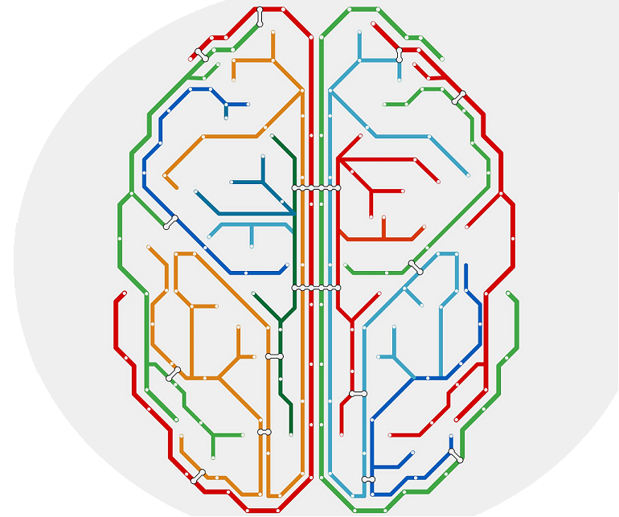

<style type="text/css">

#TOC {
margin-top: 100px;
}

.section h2{
padding-top: 150px;
}

.leftA{
float: left;
width: 100%;
font-weight: bold;
}

.rightA{
float:right;
width: 75%;
}

.leftB{
float: left;
width: 23%;
}
</style>

<br>

<div class = "leftA">
Introduction
</div>

<div class = "rightA"> 
Uncertainty can feed through into analysis and subsequent decision making from many different sources.  Each step in data collection, data processing and modelling is likely to bring added uncertainty.
</div>

<br>

<div class = "rightA"> 
Try to identify and record all the potential sources of uncertainty in your analysis at an early stage.  Early identification of uncertainty is important; if you overlook a potential source of uncertainty this could reduce the usefulness and impact of your subsequent analysis.
</div>

<div class = "rightA">
This section sets out a range of techniques to help you understand the resulting uncertainty in your analysis.
</div>


<div style="clear: both;"></div>

## Defining uncertainty

<div class = "rightA"> 
It is useful to distinguish between distinct classifications of uncertainty. Understanding the characteristics of different classifications of uncertainty can help you to identify sources of uncertainty in your own analysis.  Further, categorising the types of uncertainty provides a framework for the next steps of analysis.
</div>

<div class = "rightA"> 
A common classification divides uncertainty into known knowns, known unknowns, and unknown unknowns.  We explain these in Table 2.1.
</div>


```{r fig.align="center", echo=FALSE, out.width='100%'}

knitr::include_graphics("images/maxresdefault.png")

```

<br><br>

<div class = "leftA">
Table 2.1: Classifications of Uncertainty
</div>

| Classification  | Known knowns - Aleatory uncertainty | Known unknowns - Epistemic uncertainty | Unknown unknowns - Ontological uncertainty |
| --------------- | ------------------------- | ---------------------------- | -------------------------------- | 
| <b>Definition</b>| Known knowns are <b>things we know that we know</b>. This refers to the inherent uncertainty that is always present due to underlying probabilistic variability. | Known unknowns are <b>things that we know we don’t know</b>. This type of uncertainty comes from a lack of knowledge about the (complex) system we are trying to model. Assumptions are used to plug these gaps in the absence of information. | Unknown unknowns are <b>things that we don't know we don't know </b>.  It usually comes from factors or situations that we have not previously experienced and therefore cannot consider because we simply don’t know where to look in the first instance. |
| <b>Can it be quantified? </b> | <b>Yes</b> it can be quantified. We usually characterise it using a probability distribution function (PDF). A PDF gives all the possible values that a variable can have and assigns a probability of occurrence to each. As analysts, the challenge for us is to derive the PDF. If you find that you can’t then you may instead have a known unknown. | <b>Yes</b> it can be quantified (but isn’t always) – e.g. through sensitivity analysis. These techniques try to quantify the uncertainty by altering assumptions and observing the impact on modelling outputs. They will work if the range of assumptions tested covers the range of unknown variables. | <b>No</b> it cannot be quantified.  We cannot identify unknowable unknowns, so there are no actions we can take to quantify them. What we can do is be clear about the sources of uncertainty we have included, so that any others subsequently identified would likely add to that uncertainty. |
| <b> Can it be reduced? </b> | This type of uncertainty cannot be completely removed.  We can sometimes reduce it through data smoothing or increasing the size of a sample, but there will always be some random variability. | Known unknowns are reducible by gathering information to lessen the gaps in our knowledge.  Using new data sources, expanding our data collection or conducting research can remove the need for assumptions or refine their ranges. | This type of uncertainty is not reducible. However, this type of uncertainty can usually be separated into “unknowable unknowns” and “knowable unknowns”. Horizon scanning can help identify knowable unknowns. Once they are identified they become known unknowns (in the middle column).  |
| <b> Example </b> | Tossing a coin is an example of a known known. We can observe the possible outcomes (heads or tails) and the probability of each occurring (50:50), therefore create the PDF. However, prior to the coin being tossed we cannot reduce the uncertainty in outcome. | Taking our coin toss example, we don’t know whether the coin is fair in the first instance. We may assume the coin is fair and will give a 50% probability of each outcome. Once we start to toss the coin, we start to gather information on its fairness. The longer we toss the coin the better our information gets and the greater the reduction in the known unknown. | Unknown unknowns are often future events or circumstances that we cannot predict. An example could be the introduction of a new technology that was previously unheard of. If the new technology affects the operation of a system, previous analysis is no longer reliable as it didn’t account for this change. |

```{r fig.align="center", echo=FALSE, out.width='100%'}


```


<div style="clear: both;"></div>

## Sources of uncertainty

<div class = "rightA">
The data that feeds into your analysis project will have been previously specified, defined, and collected. In some cases, you will do this yourself, but more commonly you will draw on data sources collected by others. Having chosen your data sources for your project the following checklist (Table 2.2) can be used to help identify and quantify any sources of uncertainty.
</div>

<div class = "rightA">
To gain a full picture of the impact of uncertainty on your analysis you should think through what you know about the size and distribution of uncertainties, and how you might include this information in your analysis.  The list is not exhaustive. Rather, it is intended as an aid to critical thinking about practical steps you can take to quantify uncertainty. 
</div>

<div class = "rightA">
Usually, it is not possible to quantify exactly the level of uncertainty in your analysis.  Where measurement is difficult or incomplete, think about what you can say about the reliability of your measures and what might be missing. 
</div>

```{r fig.align="center", echo=FALSE, out.width='100%'}



```

<div class = "leftA">
Table 2.2: Sources of uncertainty
</div>

| <b>Data Checklist</b> |  | <b>Approaches for understanding uncertainty</b> |
| --------------------- | ------------------------- | ---------------------------- |
|<b>How well does your data source compare with your analysis objective?</b>| How well do the definitions and concepts in the data chosen fit with what you are trying to measure? Differences between the data and your target group can mean that a dataset captured for one purpose is inappropriate for another. For example, you might want to analyse London & South East but only have data for the whole of the UK.  | Think about how the measures differ, how the concepts they capture differ and how you can adjust for this. |
|<b> Where do the data come from and how were they collected?</b> | How rigorous was the data collection process? <br><br> Was the data owner’s quality assurance sufficiently robust? <br><br> Would respondents have fully understood the question intent? <br><br> For example, poorly designed survey questions or coding tools to capture responses may lead to ambiguity, inconsistency or bias in responses. <br><br> Some datasets are subject to regulation and compliance with standards or other codes of practice.  In such cases, quality should be well documented and assured like in National Statistics | Check for documentation and QA of the data. <br><br> Read footnotes carefully in statistical releases. |
|<b> Is there more than one data source? </b> | | You might be able to use one source to validate another or use it to help quantify the uncertainty. |
|<b> What period does the data cover?  </b> | More uncertainty will occur if either the data don’t match the time period of interest and/or if the data are volatile. | If your data are volatile, consider using smoothing or estimation methods.|
|<b> At what stage did you obtain the data? </b> | For data obtained in a processed state from others you may need to explore what processing steps were taken to determine how that may affect the data you are using. <br><br> For raw data that you have collated, processed and cleaned yourself you will already have a good understanding of any issues. | |
|<b>Are there coding differences? E.g. age groups that don’t align? </b>| Coding can cause problems when the coding classification does not match your target concept or coding is inconsistent across different data sets. | You could include additional analysis on more groups to assess the impact on your analysis. |
|<b>How have missing values been treated? Have they been imputed? </b> | Treatment of missing values may be done through imputation – where values are substituted either based on a relationship with other variables or copied from a similar record. | Understanding where imputations have been made, reading footnotes carefully. |
|<b>How have surveys been calibrated? </b>| Adjustments to the weights of survey responses are used to make survey results representative of a wider population. | Make sure you understand any adjustments and ensure it doesn’t conflict with your analysis. |
|<b>How have extreme values been processed? </b>| Extreme values or outliers can arise because of coding or measurement errors, but also because of genuinely unusual outcomes. <br><br> How certain are you are that outlying data points are valid? <br><br> Have outliers already been treated or removed before you got the data? The choice of how to deal with an outlier will differ in each piece of analysis. | Consider how the retention or exclusion of an outlier will affect your results. Truncation or removal of outliers will typically introduce bias but this may be tolerated in exchange for reduced variance. |
|<b>How have datasets been matched and linked? </b> |Combining datasets can increase their value and identify new relationships between variables, but data linkage can result in two types of errors: false positive matches and false negative matches. | What do you know about the impacts of data linking on your analysis? |
|<b>How has statistical disclosure control been applied? </b> | In most cases, disclosure control will mean a loss of accuracy which may reduce the usefulness of the data.  <br><br> How was disclosure control done and what are the impacts? Well designed anonymisation should usually result in loss of detail with no systematic impact - but poorly designed disclosure control can introduce structural effects or biases in results. | Check for caveats around disclosure control that could introduce uncertainty in your data. |
|<b> What do you know about bias and uncertainty in the data? <b>| Statistical sources often come with supporting information about accuracy and reliability. You can sometimes find information on variance (or standard errors, confidence intervals, coefficients of variation) and you may find indications of likely bias, from special studies comparing or linking sources. These direct measures of quality, together with indirect measures such as response and coverage rates can tell you a lot about the uncertainty. <br><br> In the absence of direct measure of variance, be aware that small sample sizes will increase the margin of error in your results. <br><br> Is your data inherently volatile? | Are there known biases or uncertainties in the data that you can quantify and potentially correct? For example, is there information about systematic causes of missing data entries or under-reporting that you have data on or can correct through external validation or weighting? |


```{r fig.align="center", echo=FALSE, out.width='100%'}


```


<div style="clear: both;"></div>

## Assumptions 

<br> 

<div class= "rightA">
Considering the assumptions you're making in your analysis is critical to any uncertainty analysis
</div>

<div class = "leftA">
Table 2.3: Assumptions
</div>


| Consideration  |   |
| ----------- | ----------------------------------------------------------- |
| <b> Consider where you have used assumptions</b> | Assumptions are used when we have incomplete knowledge. All models will require some assumptions, so you need to ensure that assumptions are robust and consistently understood.  There should be an assumptions log.  Where did the assumptions come from?  How were they generated and why?  What is the impact if they are wrong, and how often are they reviewed? <br><br> |
| <b>What assumptions are outside the scope of the model?</b> | There are often parameters outside of the scope of the model that have been implicitly assumed. For example, models may assume no substantial policy changes in related areas. These assumptions provide the context in which the modelling results are appropriate.  You need to be aware of the limitations that these assumptions impose on analytical results. <br><br>  |
| <b>Assess the quality of each assumption </b> |Assumptions should be based on robust evidence. The less evidence to support an assumption the more uncertain it will be. High quality assumptions will be underpinned by robust data, while low quality assumptions may simply be an opinion or may be supported by a poor data source. <br><br> |
| <b>Assess the impact of each assumption </b> | The importance of an assumption is measured by its effect on the on the analytical output. The higher the impact of an assumption the more uncertain results will be. Critical assumptions will drastically affect the results, while less importance assumptions may only have a marginal effect on results. More weight should be given to gathering evidence to improve the quality of critical assumptions. <br><br> |
| <b>What don’t you know? (unknown unknowns) </b> | Some uncertainties can’t be captured in an assumption as we don’t have perfect insight. However, effort should be made to identify all possible uncertainties and capture these as assumptions. The assumptions log will convey the boundary of what has been included. <br><br> |

