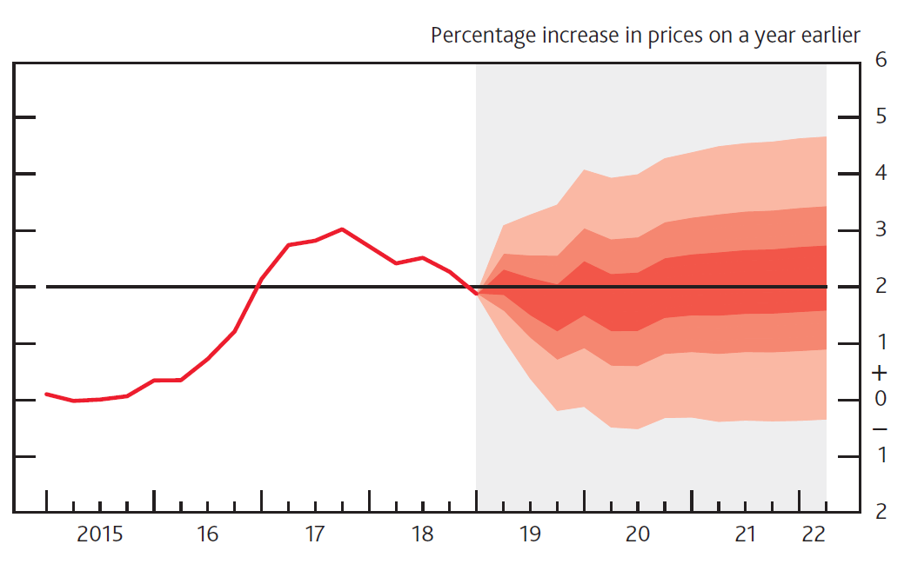

<style type="text/css">

#TOC {
margin-top: 100px;
}

.section h2{
padding-top: 150px;
}

.leftA{
float: left;
width: 100%;
font-weight: bold;
}

.rightA{
float:right;
width: 75%;
}

.leftB{
float: left;
width: 23%;
}
</style>

<br>

<div class = "rightA"> 
We now consider how to choose <i>what</i> messages about uncertainty we shouuld communicate to decision makers and give advice on <i>how</i> to communicate those messages effectively.
</div>

<div style="clear: both;"></div>
 
## Deciding what to communicate

<br>

<div class = "rightA">
The analysis of uncertainty is often complex. Presenting this in its entirety could overwhelm the recipient and may mean they do not take away the key messages. We need to choose carefully which messages about uncertainty to communicate to decision makers – ensuring they receive enough information to understand the key points, without receiving so much that it clouds the central issue. <br><br> You should also consider the onward communication of your message to ensure that when your work is passed on to others its core message and integrity are maintained.
</div>

<div style="clear: both;"></div>

## What decision is the uncertainty informing?

<br>

<div class = "leftB"> 
What is the decision?
</div>

<div class = "rightA">
When deciding what uncertainty to communicate you need to consider what results are most appropriate in the context of the question being asked. At this point you should refer to the first section of this guidance: Asking the right question.  
</div>

<div class = "rightA">
Consider what uncertainty is relevant to the decision maker. In the example 'what is the likelihood that this policy would save more than &#163;x?', a maximum to minimum range may be less relevant to the decision maker, and instead you should focus your communication on the ‘likelihood’ and the key drivers that affect it.
</div>

<div class = "rightA">
Understand what role the uncertainty has in the decision. How are your results likely to affect the decision being made? 
</div>

<div class = "leftB"> 
How influential is the uncertainty analysis?
</div>

<div style="clear: both;"></div>

<div class = "leftB"> 
If there is a major risk that has not been included in the analysis, then this may be greatest uncertainty
</div>

<div class = "rightA">
In some circumstances the uncertainty will be the key driver in the decision, for example if the uncertainty is large enough to indicate the result of a policy could be successful or unsuccessful. In this case the uncertainty analysis is very influential, and a more detailed   explanation is likely to be required. 
</div>

<div class = "rightA">
If quality assurance has been very limited then presenting any measure of uncertainty may be misleading. In such circumstances where the greatest source of uncertainty is the potential for error, then this should be the most prominent message that is conveyed to the decision maker. This may be in the form of an analytical assurance statement that highlights areas of concern.
</div>

<div class = "rightA">
In other cases, the uncertainty could be less important, for example your analysis might suggest that the cost of a project is uncertain, but in all cases the benefits outweigh the costs. In this case the uncertainty is less influential and may require less detailed communication. 
</div>

<div class = "rightA">
Most decision makers want certainty. This can make communicating uncertainty a difficult task. Decision makers can react adversely when faced with uncertainty, leading them to lose confidence in analysis.  When uncertainty is large, decision makers may feel that the analysis is of no use.
</div>

<div class = "leftB"> 
Don’t let uncertainty undermine confidence in the analysis
</div>

<div class = "rightA">
A useful phrase to remember is “all models are wrong, but some are useful”.  All analysis will be uncertain because every model is a simplification of reality. However, that does not stop them from being useful, models allow us to understand a system and uncertain results can help identify important features of that system. 
</div>

<div class = "rightA">
If uncertainty means that a straightforward conclusion is not possible, focus your communication on what the uncertainty analysis can tell you.  This may be the key factor that drives overall uncertainty or a greater understanding of how features of a system interact.  
</div>

<div style="clear: both;"></div>

## What is the key message?

<br>

<div class = "leftB"> 
If most uncertainty is quantified, then present this prominently
</div>

<div class = "rightA">
If most of the overall uncertainty has been quantified, and you are confident that there are no unknowns which are likely to have a major impact on the results then this should be the most prominent message. Discussion of the unquantified uncertainties and risks should be included but should be positioned so that it doesn’t reduce confidence in the main results when this is not appropriate.
</div>

<div class = "rightA">
If there are substantial unquantified uncertainties, then presenting the uncertainty that has been quantified without this important context will give a misleading impression of precision and underestimate the uncertainty. Do not present a range with incomplete coverage if you know that there are substantial uncertainties that are not accounted for in that range.
</div>

<div class = "leftB"> 
If little is quantified, then it may be better to present no quantification at all
</div>

<div class = "rightA">
If the largest source of uncertainty is the potential for a risk outside of the analysis to be realised, then this should be the most prominently displayed message.  
</div>

<div class = "leftB"> 
Is there a major risk that has not been included?
</div>

<div class = "rightA">
If quality assurance has been very limited, then presenting <i>any</i> measure of uncertainty may be misleading. When the greatest source of uncertainty is the potential for error, then this should be the most prominent message that you convey to the decision maker. This may be in the form of an analytical assurance statement that highlights areas of concern.
</div>

<div class = "leftB"> 
If quality assurance has been very limited, you should probably lead with this
</div>

<div class = "rightA">
Think about how caveats are presented. A long list is unhelpful, but two or three upfront that have the most impact on the results are likely to be more helpful and easily understood. You should explain what the caveats mean for decision makers who want to use the analysis, rather than simply setting out what they are.
</div>

<div class = "leftB"> 
Front load the important caveats and explain why they matter.
</div>

<div style="clear: both;"></div>

## Understanding the audience

<br>

<div class = "leftB">
Consider the audience when choosing appropriate communication methods
</div>

<div class = "rightA">
People respond differently to different communication methods. We need to assess the intended audience to understand the best way to share information with them. The audience might be: 
<ul><li> Analytical - may respond better to a technical explanation of the uncertainty </li>
<li> Non-analytical - may respond better to non-technical language</li>
<li> Mixed - a combination of both </li></ul>
</div>

<div class = "rightA">
If it is a group or individual you have worked with before tailor the method to what has worked well in the past (or ask them or see how they respond to different formats).
</div>

<div class = "rightA">
A good relationship with your decision maker will help you to choose the right communication approach for them. It will also help you to understand their motivations and the implications of uncertainty for their decisions.
</div>

<div class= "leftB">
Build relationships with decision makers 
</div>

<div class = "rightA">
No matter how carefully you communicate the uncertainty to your immediate client, there is a risk that uncertainty will not be communicated upwards and that only the central numbers will persist, and important caveats will be excluded. This can also occur when writing part of a larger document – you need to ensure the key messages about uncertainty survive the drafting process.
</div>

<div class= "leftB">
Be conscious of how your analysis may be used in future communication 
</div>

<div class = "rightA">
A good relationship with colleagues will minimise this risk. Work collaboratively to ensure that colleagues understand why central numbers could be misleading and in which situations it would be inappropriate for them to be communicated on their own.   Always ensure that wherever possible you have sight of further communication before it is sent.
</div>

<div class = "leftA">
Deciding how to communicate uncertainty
</div>

<div class = "rightA">
Now you have determined what the message is you need to consider how to communicate with your decision makers. Firstly, think about how you will be communicating your results. Will this be via a written report, presentation, or an oral briefing with or without visuals? Any constraints on format may steer you to an approach.
</div>

<div class = "rightA">
This section considers a range of approaches based on your understanding of the audience and the type of message you need to deliver.
</div>

<div style="clear: both;"></div>

## Communication Basics

<br>

<div class = "leftB">
Assess whether to describe uncertainty in words or attach figures
</div>

<div class = "rightA">
How something is written has a major impact on how people perceive the uncertainty. Research shows that that analysis is seen as less reliable if the outputs are conveyed only in words.  Numbers should be presented within a sentence if possible as this helps give context, making them easier to read and understand.
</div>

<div class = "rightA">
Descriptive terms such as ‘low risk’ or ‘very likely’ can be interpreted very differently by different people . If possible, it is best to attach a numerical probability and use these words in support.
</div>

<div class = "leftB">
Be careful when using descriptive terms and adhere to an established system is possible	
</div>

<div style="clear: both;"></div>

<div class = "rightA">
An exception to this is where there is an established system that your audience is used to for attaching terminology to probabilities, one that can be assumed to be well-understood by the intended audience. For example:
<ul><li> According to the IPCC (Intergovernmental Panel on Climate Change), “very likely” means 90-100% probability. </li>
<li> According to NICE (National Institute for Health and Care Excellence), probabilities of between 1 in 100 and 1 in 10 are referred to as “common”. </li></ul>
</div>

<div class = "rightA">
Presenting the likelihood of success may be perceived differently to presenting the corresponding likelihood of failure. Present the information both ways to avoid bias (e.g. “there is an 80% chance of success and a 20% chance of failure”). By adding in the chance of failure, you remind the reader that it exists and how large it is, which may otherwise be overlooked. Visual part-to-whole comparisons can help with this.
</div>

<div class = "leftB">
Use positive and negative framing 
</div>

<div class = "rightA">
There is no clear preference for choosing between probabilities and fractions (e.g. 10% probability, or 1 out of 10). Given this, the usual preferences of the audience or the ‘norm’ within the organisation may be best followed.
</div>

<div class = "leftB">
Decide how to present your numbers
</div>

<div class = "rightA">
If using fractions, keep the denominator constant (e.g. “1 in 100 vs. 2 in 100”, rather than “1 in 100 vs. 1 in 50”) and as small as possible while keeping to integers (e.g. “1 in 100” rather than “10 in 1,000”), rounding if appropriate.
</div>

<div class = "rightA">
Saying a ‘10% chance of rain’ is meaningless unless you also state the time period – e.g. in the next hour, or at some point tomorrow – and location.
</div>

<div class = "leftB">
Be clear on the specifics and applicability
</div>

<div class = "rightA">
If the outputs are only intended for use within a specific frame (for example, a specific area or to a particular group of the population), then make sure this is clearly stated alongside the outputs. 
</div>

<div class = "rightA">
Consider the overall uncertainty in the numbers you have calculated. Round them appropriately to avoid spurious accuracy (e.g. perhaps 40% rather than 38.7% if the overall uncertainty is greater than one percentage point).
</div>

<div class = "leftB">
Use an appropriate level of precision
</div>

<div class = "rightA">
Presenting a single figure is best avoided as it can give a misleading impression of precision (e.g. “between 1,200 and 1,800”, rather than “1,500”).
</div>

<div class = "leftB">
Use ranges wherever possible
</div>

<div class = "rightA">
Commissioners may request a ‘best estimate’ for ease of onward use, but you must consider the risks in providing this. Try to understand how they intend to use the analysis, so you can provide something that meets their needs while also acknowledging the uncertainty.
</div>

<div class = "rightA">
Stating a range may be perceived as a uniform distribution across the range. Conversely, stating a range around a best estimate may be perceived as a triangular distribution (or Normal with analytical audiences). Consider which of these best reflects the actual uncertainty when deciding what to present.
</div>

<div class = "leftB">
Consider whether to include a ‘best estimate’ within the range
</div>

<div class = "rightA">
Don’t simply use 95% confidence intervals by default. Think about what the outputs are going to be used for (see section 1), and discuss the level of risk and uncertainty that the decision maker wants to plan for – this might not be 5%.
</div>

<div class = "leftB">
Choose appropriate confidence/prediction intervals and be clear 
</div>

<div class = "rightA">
Be clear what confidence level you are using and ensure your audience understands what this means (avoiding precise statistical definitions if it will increase comprehension).
</div>

<div style="clear: both;"></div>

## Graphs and visualisation

<br>

<div class = "leftB">
Graphs can be an excellent way of communicating the quantified elements of uncertainty
</div>

<div class = "rightA">
Graphs and visualisations are an excellent way of communicating the outputs of analysis, and many graph types allow you to communicate uncertainty within the graphic (provided the uncertainty has been quantified).
</div>

<div class = "rightA">
Unquantified uncertainties cannot generally be included in graphs, so will need to be communicated through other means.
</div>

<div class = "rightA">
Some types of graph are not particularly well suited to displaying quantified uncertainty:
</div>

<div class = "leftB">
Some graph types cannot be used to show uncertainty clearly
</div>

<div class = "rightA">
Some simple graphs
<br>
<i>Pie charts, donut charts, stacked charts</i>
</div>

<div class = "rightA">
These should generally be avoided, except for specific datasets , because people find it difficult compare the angles or sizes of different sections . This is true for analysis in general, but particularly for uncertainty as they show only a single value for each data point.
</div>

<div class = "rightA">
More complex graphs
<br>
<i>Heat and Choropleth maps, Treemaps, Sankey diagrams</i>
</div>

<div class = "rightA">
As a general rule, it can be difficult to communicate uncertainty in very information dense visualisations such as those above. There is not space to include the necessary extra information among the colours of heatmaps, the densely packed rectangles of Treemaps or the detailed flow lines of Sankey diagram.
</div>

<div class = "rightA">
You may have the full understanding of the underlying probability distribution, or just a range within which we expect the result to fall. You may choose to only include the uncertainty due to a single dominant uncertainty, or the outputs from a range of scenarios.
</div>

<div class = "leftB">
Decide what level of detail to include on uncertainty
</div>

<div class = "rightA">
The following table suggests some graph types that can be used for most situations, each of which are described in the following section.
</div>

|                                          | Single Measure                                                                    | Multiple Measure                  | Time Series           | 2-dimensional data         |
|------------------------------------------|-----------------------------------------------------------------------------------|-----------------------------------|-----------------------|----------------------------|
| None                                     | Single point graph, or describe in prose                                          | Bar graph or line graph           | Line graph            | Scatter graph              |
| A Range                                  | Single point graph with error bars                                                | Bar or line graph with error bars | Line graph with range | Scatter with 2d error bars |
| Summary Statistics                       | Single box plot                                                                   | Series of box plots               | ?                     | ?                          |
| Maximum Detail                           | Probability Distribution Function (PDF) or Cumulative Distribution Function (CDF) | Multiple PDFs or Violin Plots     | Fan chart             | ?                          |
| Uncertainty due to the methodology       | Scatter Plot                                                                      |                                   | Spaghetti Plot        | Spaghetti Plot             |
| Uncertainty due to alternative scenarios | Describe in prose                                                                 |                                   | Multiple Line Graphs  |                            |

<div style="clear: both;"></div>

## Errors bars

<br>

<div class = "leftB">
Error bars are a simple way to illustrate a range around a data point
</div>

<div class = "rightA">
Error bars can be added to bar graphs, line graphs and scatter graphs to illustrate a range around a central estimate, within which we expect the value to lie with a given probability.
</div>

<div style="clear: both;"></div>

<div class = "leftB">
Choose an appropriate probability level based on the context
</div>

<div class = "rightA">
As referred to previously, consider the situation and decide on an appropriate level to display.  E.g., don’t apply 95% confidence/prediction intervals by default. 
</div>

<div style="clear: both;"></div>

<div class = "leftB">
Be clear about what the error bars represent
</div>

<div class = "rightA">
State what probability the error bars represent, and describe in prose how the viewer should ‘read’ the error bar.
</div>

<div style="clear: both;"></div>

<div class = "leftB">
Error bars can be applied to series of data points
</div>

<div class = "rightA">
Error bars can be added easily to a data series or time series. However, if the data are continuous (e.g. a time series) then consider whether showing multiple line graphs would be clearer than a single line graph with error bars.
</div>

<div style="clear: both;"></div>

<div class = "leftB">
2-dimensional error bars can be used where necessary 
</div>

<div class = "rightA">
If the output data are 2-dimensional, then you can apply error bars in 2 dimensions. Be careful to ensure that the resulting graph does not become illegible due to clutter.
</div>


```{r fig.align="center", echo=FALSE}

knitr::include_graphics("images/error_bars.png")

```

<div class = "rightA">
<i>Example: <b>Actual and projected performance against carbon budgets.</b> For future emissions, vertical bars show uncertainty in the projections and indicate 95% confidence intervals for the uncertainties that have been modelled.</i>
</div>

<div style="clear: both;"></div>

## Box plots

<br>

<div class = "leftB">
Box plots can convey more information about possible outcomes than a range alone 
</div>

<div class = "rightA">
Box plots can help the audience understand the underlying distribution of possible outcomes in more detail than just a range. Typically they show the median, interquartile range, maximum and minimum values for the range of possible outcomes. This can be particularly useful when the underlying distribution is skewed or non-normal.
</div>

<div style="clear: both;"></div>

<div class = "leftB">
A series of box plots can be used to compare distributions 
</div>

<div class = "rightA">
Box plots can be arranged in parallel to show the distributions for a range of measures, and can help compare the different shapes.
</div>

<div style="clear: both;"></div>

<div class = "leftB">
Think about whether the audience will be familiar with the format 
</div>

<div class = "rightA">
Box plots may not be widely understood by non-analysts, so think carefully about whether the added information will be effective, or whether a simple range would be sufficient. A labelled example can be used to help the audience interpret the format.
</div>


```{r fig.align="center", echo=FALSE}

knitr::include_graphics("images/box_plots.png")

```

<div class = "rightA">
<i>Example: <b>Deaths in the usual place of residence.</b> The graph depicts the percentage of individual that die in their usual place of residence. Box plots are used to show the variation between different Clinical Commissioning Groups, and district and local authorities. A labelled box plot is presented to explain what the ranges mean. </i>
</div>

<div style="clear: both;"></div>

## Probability density functions (PDFs)

<br>

<div class = "leftB">
PDFs show complete information on the quantified uncertainty 
</div>

<div class = "rightA">
A probability density function can be used to give complete information on the range of possible outcomes, and the likelihood of each for a given estimate.
</div>

<div style="clear: both;"></div>

<div class = "leftB">
Think about whether the audience needs this much information 
</div>

<div class = "rightA">
While presenting complete information may seem ideal, it may be more information than the audience actually needs. Would a prose description of the mean and range be sufficient?
</div>

<div style="clear: both;"></div>

<div class = "leftB">
PDFs can be useful when the distribution of outcomes is multimodal, or otherwise complex 
</div>

<div class = "rightA">
If the PDF is approximately normal, then there may be little value in displaying it, as the essential features can be described in a few words.
</div>

<div class = "rightA">
The distribution could be multimodal – for example the marks for students passing a university module may have a peak for a number who don’t study very hard, and a peak for those who worked really hard. In this case it could be misleading to present the mean, so a graphical illustration   of the distribution may be more effective.
</div>

<div style="clear: both;"></div>

<div class = "leftB">
Labelling can be used to highlight the key features 
</div>

<div class = "rightA">
It may aid clarity to draw the reader’s attention to important features, such as the mode.
</div>

<div style="clear: both;"></div>

<div class = "leftB">
<b>Multiple PDFs</b> can be used to show uncertainty across different measures
</div>

<div class = "rightA">
If we need to communicate a series of PDFs, then multiple functions can be shown to compare the range of possible outcomes across the series.
</div>

<div style="clear: both;"></div>

<div class = "rightA">
If there are only 2 or 3 these can be overlaid to make it easy to compare. With more, ‘small multiples’ are likely to be clearer.
</div>


```{r fig.align="center", echo=FALSE}

knitr::include_graphics("images/pdf.png")

```

<div class = "rightA">
<i>Example: <b>Change in Air Temperature for 2080-2099.</b> The graph shows the expected change in air temperature in 2080-99 compared to 1981-2000 for a medium emission scenario. </i>
</div>

<div style="clear: both;"></div>

## Cumulative density functions (CDFs)

<br>

<div class = "leftB">
A CDF may be more helpful than a PDF if there is a specific threshold of interest to the customer 
</div>

<div class = "rightA">
A cumulative density function essentially shows the same information as a probability density function. However a CDF may be more helpful when the audience is primarily concerned with how likely it is that the value will be below (or above) a particular point (rather than the range within which we expect the value to fall). For example, how likely is it that our costs exceed our budget? (rather than what are our costs going to be?
</div>

<div style="clear: both;"></div>

<div class = "leftB">
The most likely value is less clear on a CDF 
</div>

<div class = "rightA">
However, features such as the mode are less clear on a CDF (shown by the steepest part of the graph), as they are harder to read by eye.
</div>

<div style="clear: both;"></div>

<div class = "leftB">
Labelling can be used to highlight the key features 
</div>

<div class = "rightA">
Drawing gridlines intersecting at key points of the function can help the viewer understand how to ‘read’ the graph.
</div>


```{r fig.align="center", echo=FALSE}

knitr::include_graphics("images/cdf.png")

```

<div class = "rightA">
<i>Example: <b>Change in Air Temperature for 2080-2099.</b> The graph shows the same information as the PDF example above. The grey dotted lines indicated there is a 10% probability of a mean temperature change of less that 0.7C. The blue dotted line indicated that there is a 90% probability of a mean temperature change being less than 3.5C. </i>
</div>

<div style="clear: both;"></div>

## Fan Charts

<br>

<div class = "leftB">
Fan charts can show how uncertainty changes over time 
</div>

<div class = "rightA">
Fan charts can be used to show a series of different prediction intervals for time-series projections (e.g. 30%, 60% and 90% at the same time).  This is essentially plotting selected points from a time-dependent PDF.
</div>

<div style="clear: both;"></div>

<div class = "leftB">
Avoid including the mode 
</div>

<div class = "rightA">
Often a central ‘best estimate’ is not included, to avoid the viewer focussing on a single estimate and undermining the importance of the uncertainty
</div>


```{r fig.align="center", echo=FALSE}



```

<div class = "rightA">
<i>Example: <b>CPI inflation projection.</b> The graph depicts probability of various outcomes for CPI inflation in the future. The fan charts are constructed so that outturns of inflation are also expected to lie within darkest central band and each pair of the lighter red areas on 30 occasions. In any particular quarter of the forecast period, inflation is therefore expected to lie somewhere within the fans on 90 out of 100 occasions. And on the remaining 10 out of 100 occasions inflation can fall anywhere outside the red area of the fan chart (grey area). </i>
</div>

<div style="clear: both;"></div>

## Multiple Line Charts

<br>

<div class = "leftB">
Multiple line charts can be clearer than a series of error bars 
</div>

<div class = "rightA">
Multiple line charts with time series data to show a quantified range around a ‘most likely’ projection (essentially a series of error bars).
</div>

<div style="clear: both;"></div>

<div class = "leftB">
Alternative scenarios can be illustrated with multiple line graphs
</div>

<div class = "rightA">
With scenario analysis, a series of line charts can be used to show the projections from each scenario.
</div>

<div style="clear: both;"></div>

<div class = "leftB">
Give equal prominence to each scenario
</div>

<div class = "rightA">
Generally with scenario analysis each scenario should be presented with equal prominence, to avoid suggesting that one is more likely than another (unless analysis has been carried out to quantify the likelihoods of each).
</div>

<div style="clear: both;"></div>

<div class = "leftB">
Try to have an even number of scenarios 
</div>

<div class = "rightA">
Try to include an even number of scenarios, to avoid having a middle option that may be misinterpreted as the ‘most likely’ scenario.
</div>

```{r fig.align="center", echo=FALSE}

knitr::include_graphics("images/multiple_line.png")

```

<div class = "rightA">
<i>Example: <b>Employment Projections.</b> The graph presents future employment levels for different demographic scenarios. Each scenario is represented by a separate line plot. The graph does not attempt to show the probability of each scenario occurring.  </i>
</div>

<div style="clear: both;"></div>

## Tornado Diagrams

<br>

<div class = "leftB">
Tornado diagrams can be used to show the <i>sources</i> of uncertainty 
</div>

<div class = "rightA">
Tornado diagrams are different to most other graphs discussed here. They are not used to show the outputs of the analysis, but to show how different sources of uncertainty contribute to the overall uncertainty.
</div>

<div class = "rightA">
Tornado diagrams depict sensitivity of a result to changes in selected variables. They show the effect on the output of varying each variable at a time, keeping other input variables at their assumed values.
</div>

<div style="clear: both;"></div>

<div class = "leftB">
Can help communicate the reasons for uncertainty, and identify further need for analysis 
</div>

<div class = "rightA">
If the level of uncertainty is unpalatable to the customers, then this format can be useful to help focus work on reducing the level of uncertainty in key parameters.
</div>

<div style="clear: both;"></div>

<div class = "leftB">
Tornado diagrams can be misleading in complex models 
</div>

<div class = "rightA">
One limitation of the format is that only one parameter is changed at a time. There are some situations where the uncertainty due to one variable may appear small initially but becomes much more prominent if a second variable takes on a slightly different value (e.g. think of a workflow model with a bottleneck. A tornado diagram might show the bottleneck parameter to be the overwhelming uncertainty. However, if this parameter is increased slightly then the bottleneck may move elsewhere, completely changing the picture)
</div>

```{r fig.align="center", echo=FALSE}

knitr::include_graphics("images/tornado.png")

```

<div class = "rightA">
<i>Example: <b>Nuclear Levelized Cost of Electricity.</b> The graph presents the change in the levelized cost of nuclear electricity (&#163;/MWh) that would result from changes in input parameters. Impacts are shown from both 10% upward or downward movement in central estimates and from predetermined parameters ranges (high/low data range). Yellow bars represent an increase in the parameter, blue bar represent a decrease in the parameter.  </i>
</div>

<div style="clear: both;"></div>

## Infographics

<br>

<div class = "leftB">
Infographics can be useful for public facing communications 
</div>

<div class = "rightA">
Infographics are graphic visual representations of information, data or knowledge intended to present information quickly and clearly. They can improve people’s understanding by using graphics to enhance peoples’ ability to see patterns and trends.
</div>

<div style="clear: both;"></div>

<div class = "leftB">
Graphics can grab attention and make messages more accessible
</div>

<div class = "rightA">
When done well they will grab the reader’s attention from become a very powerful way of communicating key messages. Designing a good infographic may be worthwhile if your audience is less confident with data and analysis.
</div>

<div style="clear: both;"></div>

<div class = "leftB">
However, watch out for common pitfalls and follow best practice for the design
</div>

<div class = "rightA">
Like all graphs and visualisation you should ensure the information is presented clearly and truthfully. With infographics there is additional the risk that visual design elements detract from the key message. Consider the final audience for the information to determine if an infographic is the right choice and follow best practice
</div>

```{r fig.align="center", echo=FALSE}

knitr::include_graphics("images/infographic.png")

```

<div class = "rightA">
<i>Example: <b>Reoffending Behaviour After Receiving Treatment.</b> The infographic uses people icons rather than a bar chart to show the number of reoffenders in a sample. An uncertainty in the form of confidence intervals is included in the infographic </i>
</div>

<div style="clear: both;"></div>

## Interactive Tools

<br>

<div class = "leftB">
Interactive tools can be used to immerse your reader on complex matters 
</div>

<div class = "rightA">
An interactive tool can help make analysis more accessible to non-specialists. They can create an immersive experience that is easier for them to understand and is highly memorable.
</div>

<div style="clear: both;"></div>

<div class = "leftB">
Focus on specific messages 
</div>

<div class = "rightA">
Consider the overall message and where the uncertainties lie. Which aspects will the audience be interested in and what do they need to know? Use this understanding to bring focus to which interactive elements to create. 
</div>

<div class = "rightA">
The interactivity will enable your users to manipulate and get a deeper understanding of the message.
</div>

<div style="clear: both;"></div>

<div class = "leftB">
Allow reader to adjust a key variable 
</div>

<div class = "rightA">
If a key source of uncertainty is a single variable, then it may be possible to construct a display that can be changed as the user adjusts the value of this variable by moving a slider.
</div>

<div class = "rightA">
Or, if there are several key assumptions that impact the result a chart may be created that will change depending on the inputs that the user inserts.
</div>

<div class = "rightA">
Being able to see what would happen if an underlying assumption was to change is a powerful way to demonstrate the level of uncertainty we may have in a given result.
</div>

```{r fig.align="center", echo=FALSE}

knitr::include_graphics("images/interactive.png")

```

<div class = "rightA">
<i>Example: The DECC 2050 Calculator is an award-winning, user-friendly tool that helps users to explore the choices available to meet the 2050 carbon target. Whilst it doesn’t explicitly cover the uncertainty in the underlying data it does allow the user to create their own set of policies to try to reach the target. This engaging tool was helpful in demonstrating to users how difficult some of the options are and the relative impact of each choice. </i>
</div>